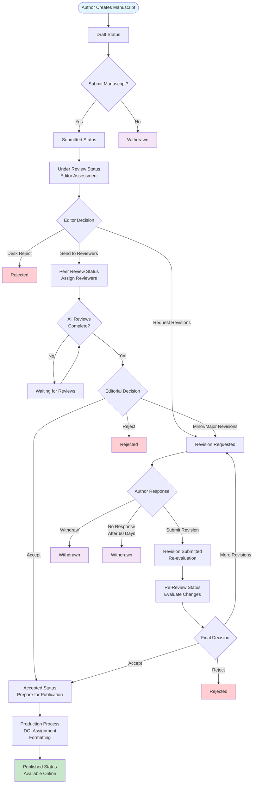

# 📋 Academic Journal Submission Review and Approval Workflow

**Document Version:** 1.0  
**Last Updated:** August 11, 2025  
**System:** African Medical and Health Sciences Journal (AMHSJ)

---

## 🎯 Overview

This document provides a comprehensive guide to the submission review and approval workflow implemented in the AMHSJ academic journal management system. The workflow encompasses the entire manuscript lifecycle from initial submission to final publication, ensuring academic rigor, efficient processing, and transparent communication.

## 📊 Workflow State Machine

### Status Definitions

| Status | Description | Stakeholder Actions |
|--------|-------------|-------------------|
| `draft` | Manuscript being prepared | Author editing |
| `submitted` | Initial submission received | System validation |
| `technical_check` | Technical and editorial assessment | Editor assessment |
| `under_review` | Sent to peer reviewers | Reviewer evaluation |
| `revision_requested` | Changes required | Author revision |
| `revision_submitted` | Revised version received | Re-review process |
| `accepted` | Approved for publication | Production preparation |
| `rejected` | Not suitable for publication | Process concluded |
| `published` | Available to public | Indexing and distribution |
| `withdrawn` | Author/editor withdrawal | Process terminated |

### Workflow State Transitions



---

## 🔄 Detailed Workflow Phases

### Phase 1: Initial Submission

#### 1.1 Author Submission Process

**Requirements:**
- Completed manuscript file (DOC/DOCX only)
- Title and abstract (required)
- Keywords (minimum 4)
- Category selection
- Author information and affiliations
- Co-author details (if applicable)

**System Actions:**
When an author submits a manuscript, the system automatically performs these steps:
1. Validates that all required fields are completed
2. Generates a unique submission ID for tracking
3. Creates article and submission records in the database
4. Sets the initial status to "submitted"
5. Sends confirmation email to the author
6. Triggers the editor assignment algorithm

**Notifications:**
- Author: Submission confirmation with tracking ID
- System: New submission alert to editorial team

#### 1.2 Automated Editor Assignment

**Assignment Algorithm:**
The system finds the most suitable editor by evaluating these criteria:
- **Specialty Matching:** Editor's expertise aligns with manuscript category
- **Workload Balance:** Current assignments versus maximum capacity
- **Availability:** Editor is active and accepting new submissions
- **Editorial Sections:** Assigned subject areas match manuscript topic
- **Performance Metrics:** Historical quality and timeliness scores

The system selects the editor with the lowest workload in the relevant specialty area.

**Assignment Process:**
1. Query active editors with matching specialties
2. Check workload capacity (current < maximum)
3. Sort by workload and expertise match
4. Assign to most suitable editor
5. Update article with editor assignment
6. Send notification to assigned editor

---

### Phase 2: Editorial Review

#### 2.1 Initial Editorial Assessment

**Editor Responsibilities:**
- Scope and journal fit evaluation
- Technical quality assessment
- Ethical compliance review
- Plagiarism screening
- Format and submission guideline compliance

**Decision Options:**
Editors have three main decision paths after initial assessment:
- **PROCEED_TO_REVIEW:** Send manuscript to peer reviewers for external evaluation
- **DESK_REJECT:** Reject manuscript without external review due to scope/quality issues
- **REQUEST_REVISION:** Ask author to revise before proceeding to peer review

#### 2.2 Editorial Decision Process

**Proceed to Peer Review:**
- Status: `submitted` → `under_review`
- Trigger reviewer assignment algorithm
- Set review timeline (default: 21 days)
- Create review invitation notifications

**Desk Rejection:**
- Status: `submitted` → `rejected`
- Send decision notification to author
- Include editorial feedback
- Process concluded

**Revision Request:**
- Status: `submitted` → `revision_requested`
- Send detailed revision requirements
- Set revision deadline
- Author response awaited

---

### Phase 3: Reviewer Assignment

#### 3.1 Intelligent Reviewer Selection

**Selection Criteria:**
The reviewer selection algorithm evaluates potential reviewers based on:

**Expertise Matching:**
- Keywords overlap analysis between manuscript and reviewer specialties
- Research area alignment with reviewer's published work
- Publication history relevance to the manuscript topic

**Availability Assessment:**
- Current review workload compared to maximum capacity
- Maximum number of reviews per month setting
- Current availability status (available, limited, unavailable)
- Historical response rate to review invitations

**Conflict Detection:**
- Institution overlap between authors and potential reviewers
- Co-authorship history within the last 10 years
- Personal or professional conflicts of interest
- Geographic proximity considerations

**Quality Metrics:**
- Review completion rate and timeliness history
- Quality scores from previous reviews
- Editorial feedback scores and ratings
- Overall reviewer performance metrics

#### 3.2 Assignment Process

**System Workflow:**
The reviewer assignment process follows these steps:
1. Query eligible reviewers based on expertise matching
2. Filter results by availability and current workload
3. Remove reviewers with detected conflicts of interest
4. Rank remaining candidates by quality metrics
5. Select the top 2-3 reviewers from the ranked list
6. Create review records in the system
7. Send personalized invitation emails to selected reviewers
8. Set review deadlines (typically 21 days from assignment)
9. Update reviewer workload counters
10. Notify the assigned editor of successful assignments

**Review Invitation Content:**
- Article title and abstract
- Review deadline (typically 21 days)
- Review guidelines and criteria
- Access to manuscript files
- Confidentiality agreement

---

### Phase 4: Peer Review Process

#### 4.1 Review Execution

**Reviewer Actions:**
When submitting a review, reviewers must provide:

**Recommendation Options:**
- **Accept:** Manuscript is suitable for publication as-is
- **Minor Revision:** Small changes needed before acceptance
- **Major Revision:** Significant changes required with re-review
- **Reject:** Manuscript not suitable for publication

**Required Components:**
- **Public Comments:** Constructive feedback visible to authors
- **Confidential Comments:** Private notes for editor only
- **Quality Rating:** Numerical score on a 1-5 scale
- **Review Criteria Assessment:** Evaluation of novelty, methodology, data quality, writing clarity, and literature review completeness

#### 4.2 Review Monitoring

**Automated Tracking:**
The system monitors review progress through:

**Deadline Reminders:**
- Reminder sent 7 days before deadline
- Second reminder sent 3 days before deadline
- Final reminder sent 1 day before deadline

**Overdue Review Handling:**
- Mark review as "overdue" status
- Send urgent reminder notifications
- Update reviewer performance metrics
- Trigger backup reviewer assignment process

**Quality Assurance:**
- Validate minimum comment length requirements
- Check recommendation consistency across reviewers
- Track timeline compliance and performance metrics

---

### Phase 5: Review Completion and Editorial Decision

#### 5.1 Review Aggregation

**Decision Algorithm:**
The system determines the manuscript status based on reviewer recommendations using this logic:

**Rejection Decision:** If any reviewer recommends "reject," the manuscript is typically rejected

**Major Revision Decision:** If any reviewer recommends "major_revision," the manuscript requires significant changes

**Minor Revision Decision:** If any reviewer recommends "minor_revision" (without rejection or major revision), minor changes are required

**Acceptance Decision:** If all reviewers recommend "accept," the manuscript is accepted for publication

**Mixed Recommendations:** When recommendations are unclear or contradictory, the status becomes "under_editorial_review" requiring editor intervention

#### 5.2 Editorial Decision Making

**Editor Review Process:**
1. Analyze all reviewer comments and recommendations
2. Assess consistency and quality of reviews
3. Consider journal fit and standards
4. Make final editorial decision
5. Prepare decision letter with consolidated feedback

**Decision Communication:**
Editorial decisions include these components:

**Decision Types:** Accept, minor revision, major revision, or reject

**Notification Content:**
- Final editorial decision with clear rationale
- Consolidated feedback from all reviewers
- Specific revision requirements (when applicable)
- Timeline expectations for next steps
- Guidance on how to proceed

---

### Phase 6: Revision Workflow

#### 6.1 Revision Request Processing

**Author Response Options:**
- Submit revised manuscript with response letter
- Withdraw submission
- Request deadline extension

**Revision Requirements:**
Authors must submit a complete revision package containing:
- **Revised Manuscript:** Updated document with all changes incorporated
- **Response Letter:** Point-by-point response addressing each reviewer comment
- **Change Tracking:** Document highlighting all modifications made
- **Additional Data:** Supplementary materials if specifically requested by reviewers

#### 6.2 Re-review Process

**Re-review Decision Matrix:**

**Minor Revisions:**
- **Reviewer Assignment:** Same reviewers (if available) to ensure consistency
- **Timeline:** 10-14 days for review completion
- **Scope:** Verification that requested changes were adequately addressed

**Major Revisions:**
- **Reviewer Assignment:** Same reviewers preferred, but new reviewers may be assigned if necessary
- **Timeline:** 21-28 days for comprehensive re-evaluation
- **Scope:** Full re-evaluation of the manuscript with significant changes

---

### Phase 7: Acceptance and Publication

#### 7.1 Acceptance Process

**Post-Acceptance Workflow:**

**Immediate Actions:**
- Send acceptance notification to author and co-authors
- Initiate DOI (Digital Object Identifier) registration process
- Schedule production timeline and milestones
- Request copyright transfer forms from authors

**Production Steps:**
- Professional copyediting and formatting
- Author review and approval of proofs
- Final corrections and quality checks
- Publication scheduling and release planning

#### 7.2 Publication Process

**Publication Pipeline:**
1. Final manuscript preparation
2. DOI assignment and registration
3. Metadata creation for indexing
4. Online publication
5. Distribution to indexing services
6. Author and stakeholder notifications

---

## 🔔 Notification System

### Email Notifications

| Trigger Event | Recipients | Template | Timing |
|---------------|------------|----------|---------|
| Submission Received | Author | `submissionConfirmation` | Immediate |
| Editor Assignment | Editor | `editorAssignment` | Immediate |
| Review Invitation | Reviewer | `reviewInvitation` | Immediate |
| Review Reminder | Reviewer | `reviewReminder` | 7, 3, 1 days before |
| Review Completed | Editor, Author | `reviewCompleted` | Immediate |
| Editorial Decision | Author | `editorialDecision` | Immediate |
| Revision Request | Author | `revisionRequest` | Immediate |
| Acceptance | Author | `manuscriptAccepted` | Immediate |
| Publication | Author, Stakeholders | `publicationNotice` | Upon publication |

### In-App Notifications

**System Notification Types:**
- **SUBMISSION_RECEIVED:** New submission confirmation for authors
- **REVIEW_ASSIGNED:** New review assignment notification for reviewers
- **REVIEW_REMINDER:** Review deadline approaching alerts
- **REVIEW_COMPLETED:** Review submitted successfully confirmations
- **EDITORIAL_DECISION:** Decision available notifications
- **REVISION_REQUESTED:** Revisions required alerts
- **MANUSCRIPT_ACCEPTED:** Manuscript accepted celebrations
- **PUBLICATION_LIVE:** Article published announcements

---

## 📊 Performance Metrics and Quality Assurance

### Key Performance Indicators

**Target Metrics:**
- **Submission to First Decision:** 8-12 weeks from submission to initial editorial decision
- **Review Completion Rate:** Greater than 95% of assigned reviews completed
- **Reviewer Response Time:** Less than 21 days average for review completion
- **Editorial Decision Time:** Less than 14 days post-review for editorial decisions
- **Revision Cycle Time:** Less than 6 weeks for revision and re-review process
- **Acceptance to Publication:** Less than 8 weeks from acceptance to online publication

### Quality Assurance Measures

**Automated Monitoring:**
- Review deadline compliance tracking
- Reviewer performance analytics  
- Editorial decision timeline monitoring
- Author satisfaction surveys
- Stakeholder feedback collection

**Manual Quality Controls:**
- Monthly editorial board review of delayed submissions
- Quarterly reviewer performance assessment
- Annual system efficiency analysis
- Peer comparison with other medical journals

**Performance Standards:**

**Reviewer Quality Standards:**
- Minimum comment length of 200 characters
- Required sections: strengths, weaknesses, and recommendations
- Rating consistency within 1 point of peer ratings
- Specific, actionable feedback required

**Editorial Quality Standards:**
- Decision justification required for all rejections
- Timeline compliance greater than 90% within target timeframes
- Appeal reversal rate less than 10% annually
- Reviewer satisfaction rating greater than 4.0 out of 5.0

**System Quality Standards:**
- Uptime requirement greater than 99.5%
- Notification delivery success rate greater than 98%
- Response time less than 2 seconds average page load
- Data integrity with zero tolerance for data loss

**Escalation Procedures:**

**Overdue Review Management:**
- Day 7: Gentle reminder with performance note
- Day 14: Urgent reminder, backup assignment, and supervisor notification
- Day 21: Replace reviewer, editor notification, and performance review trigger
- Day 28: Formal performance improvement plan initiation

**Stalled Submission Management:**
- Week 12: Status inquiry to editor with timeline update
- Week 16: Editorial board review and resource allocation assessment
- Week 20: Editor-in-Chief intervention and process audit
- Week 24: Emergency editorial decision or external consultation

**Quality Issue Management:**
- Poor reviews: Reviewer training and quality monitoring
- Editorial delays: Workload assessment and support allocation
- System failures: Immediate technical intervention and backup activation
- Appeal trends: Process review and policy clarification

**Continuous Improvement Process:**
- Monthly metrics review and trend analysis
- Quarterly stakeholder feedback surveys
- Annual external process audit
- Bi-annual policy and procedure updates

---

## 🛠️ Technical Implementation

### Database Schema Overview

```sql
-- Core workflow tables
articles (id, title, abstract, status, author_id, editor_id, ...)
submissions (id, article_id, status, status_history, ...)
reviews (id, article_id, reviewer_id, status, recommendation, ...)
notifications (id, user_id, type, message, is_read, ...)

-- User management
users (id, email, name, role, ...)
reviewer_profiles (user_id, availability, max_reviews, ...)
editor_profiles (user_id, assigned_sections, workload, ...)

-- Communication
conversations (id, type, participants, ...)
messages (id, conversation_id, sender_id, content, ...)
```

### API Endpoints

```typescript
// Submission management
POST /api/submissions                    // Create new submission
GET  /api/submissions/:id               // Get submission details
PUT  /api/submissions/:id/status        // Update submission status

// Review management  
POST /api/reviews/:id/assign            // Assign reviewers
PUT  /api/reviews/:id/submit            // Submit review
GET  /api/reviews/overdue               // Get overdue reviews

// Editorial decisions
POST /api/editorial/:id/decision        // Make editorial decision
GET  /api/editorial/pending             // Get pending decisions

// Notifications
GET  /api/notifications                 // Get user notifications
PUT  /api/notifications/:id/read        // Mark as read
```

---

## � Stakeholder Roles and Responsibilities

### Detailed Role Definitions

#### **Author**
- **Primary Responsibilities:**
  - Submit original, unpublished manuscripts
  - Ensure compliance with submission guidelines
  - Respond to reviewer comments within specified deadlines
  - Provide revision materials and response letters
  - Maintain confidentiality during review process
- **Rights:**
  - Access to reviewer feedback and editorial decisions
  - Request deadline extensions with justification
  - Withdraw submission at any stage
  - Appeal editorial decisions through formal process

#### **Reviewer**
- **Primary Responsibilities:**
  - Provide timely, constructive, and unbiased reviews
  - Maintain confidentiality of manuscripts under review
  - Declare conflicts of interest
  - Adhere to review deadlines (21 days standard)
  - Provide detailed feedback on methodology, significance, and clarity
- **Rights:**
  - Decline review invitations without penalty (within reason)
  - Request deadline extensions for valid reasons
  - Access reviewer guidelines and training materials
  - Receive recognition for review contributions

#### **Editor**
- **Primary Responsibilities:**
  - Conduct initial manuscript assessment for scope and quality
  - Assign appropriate reviewers based on expertise
  - Make editorial decisions based on reviewer feedback
  - Communicate decisions clearly to authors
  - Maintain journal standards and ethical guidelines
- **Decision Authority:**
  - Accept/reject based on peer review
  - Request revisions (minor/major)
  - Override reviewer recommendations with justification
  - Handle appeals and ethical concerns

#### **Editor-in-Chief**
- **Primary Responsibilities:**
  - Oversee entire editorial process and journal strategy
  - Handle complex editorial decisions and appeals
  - Manage editorial board and reviewer pool
  - Ensure ethical standards and publication integrity
- **Escalation Authority:**
  - Final decision on disputed manuscripts
  - Reviewer and editor performance management
  - Policy decisions and guideline updates
  - External relationship management

#### **Administrator**
- **Primary Responsibilities:**
  - System configuration and maintenance
  - User account management and role assignments
  - Monitor workflow performance metrics
  - Technical support and troubleshooting
- **System Access:**
  - Full system configuration rights
  - Performance analytics and reporting
  - User management and role modifications
  - Workflow customization and optimization

### Peer Review Model

**AMHSJ Peer Review Process: Single-Blind**

**Process Type:** Single-blind peer review
**Description:** Reviewers know author identities, but authors do not know reviewer identities

**Rationale for Single-Blind Model:**
- Allows reviewers to consider author expertise and track record
- Enables constructive feedback with author context
- Maintains reviewer anonymity to ensure honest feedback
- Aligns with medical journal best practices

**Anonymity Protocol:**
- **Reviewer to Author:** Anonymous (identities protected)
- **Author to Reviewer:** Known (names and affiliations visible)
- **Editor Visibility:** Full transparency to both parties

**Alternative Models Considered:**
- **Double-Blind:** Rejected due to difficulty in maintaining anonymity in specialized medical fields
- **Open Review:** Under consideration for future implementation as optional model

---

## 🚨 Conflict of Interest Management

### Conflict Detection and Resolution

#### **Automatic Conflict Detection:**

**Institutional Conflicts:**
- Same institution: Automatic exclusion from reviewer pool
- Affiliated institutions: Manual review required by editor
- Recent collaborations: 5-year lookback period for exclusion

**Publication Conflicts:**
- Co-authorship: 10-year exclusion period from assignment
- Citing relationships: Recent citation analysis and evaluation
- Competitive research: Similar topic detection and flagging

**Personal Conflicts:**
- Mentor-student relationships: Permanent exclusion
- Family relationships: Self-declared conflicts honored
- Commercial interests: Financial disclosure review required

#### **Conflict Resolution Process:**
1. **Automatic Exclusion:** System removes conflicted reviewers from eligible pool
2. **Flagged Conflicts:** Editor review for borderline cases
3. **Self-Declared Conflicts:** Reviewers can declare additional conflicts
4. **Post-Assignment Discovery:** Immediate reassignment if conflict discovered
5. **Documentation:** All conflict decisions logged for transparency

#### **Conflict Types and Actions:**
| Conflict Type | Detection Method | Action |
|---------------|------------------|---------|
| Same Institution | Database matching | Auto-exclude |
| Co-authorship | Publication database | Auto-exclude (10 years) |
| Recent Collaboration | Citation analysis | Auto-exclude (5 years) |
| Competitive Research | Keyword similarity | Flag for review |
| Personal/Financial | Self-declaration | Auto-exclude |
| Geographic Proximity | Location analysis | Flag for consideration |

---

## 🤝 Editorial Decision Process for Mixed Recommendations

### Handling Contradictory Reviews

#### **Mixed Recommendation Scenarios:**

**Scenario 1: Minor Disagreement**
- Reviews: Accept, Minor Revision, Accept
- Likely Decision: Minor Revision
- Rationale: Address concerns before acceptance

**Scenario 2: Major Disagreement**
- Reviews: Accept, Reject, Major Revision
- Action: Seek Additional Review
- Rationale: Too much disagreement for confident decision

**Scenario 3: Revision Disagreement**
- Reviews: Minor Revision, Major Revision
- Likely Decision: Major Revision
- Rationale: Take more conservative approach

#### **Editor Decision Framework:**
1. **Review Quality Assessment:**
   - Evaluate depth and specificity of each review
   - Consider reviewer expertise and track record
   - Assess internal consistency of recommendations

2. **Evidence-Based Decision Making:**
   - Prioritize reviews with detailed justifications
   - Consider alignment with journal standards
   - Evaluate manuscript's contribution significance

3. **Additional Review Criteria:**
   **High Disagreement:** Opinion spread greater than 2 recommendation levels
   **Insufficient Detail:** Reviews lack specific feedback or justification
   **Expertise Mismatch:** Reviewers outside core expertise area
   **Strategic Importance:** High-impact or controversial topics

4. **Resolution Process:**
   - **Seek Additional Review:** Assign third/fourth reviewer
   - **Editorial Override:** Make decision with detailed justification
   - **Author Consultation:** Request clarification on specific points
   - **Board Consultation:** Escalate to editorial board for complex cases

---

## 🔄 Clarified Status Definitions and Transitions

### Enhanced Status Definitions

| Status | Phase | Description | Duration | Next Actions |
|--------|-------|-------------|----------|--------------|
| `draft` | Pre-submission | Author preparing manuscript | Indefinite | Submit or abandon |
| `submitted` | Initial intake | System validation complete | 1-3 days | Editor assignment |
| `under_review` | Editorial assessment | Editor initial evaluation | 5-10 days | Proceed/reject/revise |
| `under_review` | External review | Reviewer evaluation phase | 21-28 days | Await reviews |
| `reviews_complete` | Decision pending | All reviews received | 7-14 days | Editorial decision |
| `revision_requested` | Author revision | Changes required | 30-60 days | Submit revision |
| `revision_submitted` | Re-evaluation | Revised version received | 1-3 days | Re-review process |
| `re_review` | Second review | Evaluation of revisions | 14-21 days | Final decision |
| `accepted` | Production | Approved for publication | 2-8 weeks | Publication prep |
| `rejected` | Terminal | Not suitable | N/A | Process concluded |
| `published` | Live | Available to public | Indefinite | Post-pub activities |
| `withdrawn` | Terminal | Removed from process | N/A | Archive/cleanup |

### Withdrawal Process Details

#### **Withdrawal Triggers and Procedures:**

**Author-Initiated Withdrawal:**
- Triggers: Personal decision, duplicate submission, funding issues
- Process: Simple withdrawal request form
- Timeline: Immediate upon request
- Data Retention: Reviews archived, manuscript removed

**Editor-Initiated Withdrawal:**
- Triggers: Ethical violations, plagiarism detected, fake data
- Process: Formal investigation and notification
- Timeline: After due process (7-14 days)
- Data Retention: Full record maintained for audit

**System-Initiated Withdrawal:**
- Triggers: Extended author non-response (greater than 90 days), technical issues
- Process: Automated with notification
- Timeline: After grace period expires
- Data Retention: Archived with restoration option

---

## ❓ Frequently Asked Questions (FAQ)

### **For Authors**

**Q: My manuscript was rejected. Can I see the reviewer comments, and is there a process for appealing the decision?**
A: Yes, you will receive detailed reviewer comments with the rejection notice. AMHSJ has a formal appeal process:
- Submit appeal within 30 days of decision
- Provide detailed response to reviewer concerns
- Appeals reviewed by Editor-in-Chief or independent editor
- Decision timeline: 14-21 days
- Appeal outcomes: Reversal, re-review, or upheld rejection

**Q: What happens to my manuscript if I withdraw it?**
A: Upon withdrawal:
- Manuscript files are removed from active system
- Reviewer comments are archived for record-keeping
- Your submission history shows "withdrawn" status
- No impact on future submission eligibility
- Data retained for 7 years per institutional policy

**Q: Can I submit a revised version of a rejected manuscript as a new submission?**
A: Yes, but with conditions:
- Must address previous reviewer concerns
- Include cover letter explaining changes made
- May be assigned to different reviewers
- Previous review history available to editor

### **For Reviewers**

**Q: What is the policy for declining a review invitation? Does it negatively impact my reviewer performance metrics?**
A: Declining reviews is acceptable and expected:
- No penalty for reasonable decline rate (<50%)
- Valid reasons include: workload, conflicts, expertise mismatch
- System tracks decline reasons for improvement
- Excessive declining (>70%) may affect future invitations
- Quality of completed reviews more important than acceptance rate

**Q: What happens if I miss a review deadline?**
A: Late review process:
- Day 7 overdue: Gentle reminder sent
- Day 14 overdue: Urgent reminder + backup reviewer assigned
- Day 21 overdue: Review cancelled, replacement assigned
- Performance impact: Noted in reviewer profile
- Mitigation: Request extensions before deadline

**Q: Can I see the other reviewers' comments on the same manuscript?**
A: No, reviewer comments are kept confidential between individual reviewers and editors to ensure independent evaluation.

### **For Editors**

**Q: What happens if all the initially invited reviewers decline? Does the system automatically initiate a search for new reviewers?**
A: Reviewer replacement process:
- System alerts editor when invitation declined
- Automatic suggestion of alternative reviewers
- Editor can manually select from suggested list
- Escalation to Editor-in-Chief if no suitable reviewers found
- Option to modify manuscript scope or seek external reviewers

**Q: How do I handle a situation where reviews are of poor quality?**
A: Poor review management:
- Request additional reviews from high-quality reviewers
- Provide feedback to poor reviewer (constructively)
- Consider reviewer training or removal from pool
- Document quality issues in reviewer profile
- Make editorial decision based on available good evidence

### **For Administrators**

**Q: What is the exact logic for the findSuitableEditor algorithm?**
A: Editor selection algorithm weights:

**Selection Weights:**
- **Specialty Match:** 40% - Primary expertise alignment
- **Workload Availability:** 30% - Current versus maximum capacity
- **Performance History:** 20% - Quality and timeliness metrics
- **Geographic Diversity:** 10% - Optional balancing factor

**Selection Process:**
1. Filter editors by specialty (exact or related match)
2. Remove editors at capacity (workload greater than or equal to maximum)
3. Calculate composite score using weights above
4. Rank by score and select highest available
5. Fallback to general editors if no specialists available

**Q: How are performance metrics calculated for reviewers and editors?**
A: Performance calculation:

**Reviewer Metrics:**
- **Timeliness Score:** Percentage of on-time reviews (0-100 scale)
- **Quality Score:** Editor ratings average (1-5 scale)
- **Reliability Score:** Completion rate of accepted reviews
- **Responsiveness:** Average time to respond to invitations

**Editor Metrics:**
- **Decision Timeliness:** Average days from review completion to decision
- **Decision Quality:** Appeal reversal rate (lower is better)
- **Workload Management:** Manuscripts handled versus capacity
- **Reviewer Satisfaction:** Feedback scores from assigned reviewers

---

## �🔧 Configuration and Customization

### Workflow Configuration

**Review Deadlines:**
- Initial review: 21 days
- Revision review: 14 days
- Major revision review: 28 days

**Assignment Limits:**
- Maximum reviewers per article: 4
- Maximum reviews per reviewer per month: 3
- Minimum reviewers required: 2

**Notification Timing:**
- Reminder days before deadline: 7, 3, 1 days
- Escalation days after deadline: 7, 14, 21 days

### Role-Based Permissions

**Author Permissions:**
- Submit new manuscripts
- Revise existing submissions
- View own submissions and status

**Reviewer Permissions:**
- Accept review invitations
- Submit completed reviews
- View assigned manuscripts only

**Editor Permissions:**
- Assign reviewers to manuscripts
- Make editorial decisions
- View manuscripts in assigned sections

**Administrator Permissions:**
- Manage all user accounts
- View all system data
- Configure system settings

---

## 📚 Troubleshooting and Support

### Common Issues and Solutions

| Issue | Symptoms | Resolution | Prevention |
|-------|----------|------------|------------|
| Reviewer Not Responding | No review after deadline | Auto-assign backup reviewer, Send urgent reminders | Better initial screening, Clear expectations |
| Editorial Delay | Decision pending >14 days | Escalate to editor-in-chief, Assign backup editor | Workload monitoring, Clear timelines |
| Author Non-Response | No revision after 60 days | Mark as withdrawn, Send final notice | Regular reminders, Clear deadlines |
| System Notifications Failed | Users not receiving emails | Check email service status, Verify addresses | Redundant notification methods |
| Poor Quality Reviews | Insufficient reviewer feedback | Request additional reviews, Reviewer training | Better reviewer selection, Quality monitoring |
| Mixed Recommendations | Conflicting reviewer decisions | Seek additional review, Editorial override | Clear review guidelines, Expert matching |

### Escalation Procedures for Performance Issues

#### **Submission Timeline Violations:**

**Submission to First Decision:**
- Target: 8-12 weeks
- Week 14: Editor inquiry and status update
- Week 16: Editorial board notification
- Week 18: Editor-in-Chief intervention
- Week 20: Emergency reviewer assignment or editorial decision

**Review Completion:**
- Target: 21 days
- Day 28: Backup reviewer assignment initiated
- Day 35: Original reviewer removed, urgent replacement
- Day 42: Editor-in-Chief review of process bottleneck

#### **Quality Assurance Interventions:**
- **Reviewer Training:** Mandatory for quality scores <3.0
- **Editor Coaching:** For decision reversal rates >15%
- **System Optimization:** For technical delays >48 hours
- **Process Review:** For any KPI missing target by >20%

### Support Contacts and Response Times

| Issue Type | Contact | Response Time | Resolution Time |
|------------|---------|---------------|-----------------|
| **Technical Issues** | system-admin@amhsj.org | 4 hours | 24-48 hours |
| **Editorial Queries** | editorial-office@amhsj.org | 24 hours | 3-5 days |
| **General Support** | support@amhsj.org | 12 hours | 1-3 days |
| **Emergency Issues** | emergency@amhsj.org | 1 hour | 4-8 hours |
| **Appeals Process** | appeals@amhsj.org | 48 hours | 14-21 days |

### Detailed Appeal Process

#### **Author Appeal Rights:**

**Eligibility Criteria:**
- **Decisions:** Rejected manuscripts, Major revision requirements
- **Timeline:** 30 days from decision notification
- **Grounds:** Reviewer bias, Procedural errors, Misunderstanding of content

**Submission Requirements:**
- **Formal Letter:** Detailed explanation of appeal grounds
- **Point-by-Point Response:** Address each reviewer concern
- **Additional Evidence:** New data or clarifications if applicable
- **Processing Fee:** None required

**Review Process:**
- **Initial Review:** Editorial office (5-7 days)
- **Merit Assessment:** Independent editor (7-10 days)
- **Final Decision:** Editor-in-Chief (3-5 days)
- **Notification:** Detailed response within 21 days total

**Possible Outcomes:**
- **Appeal Upheld:** Decision reversed, manuscript re-enters process
- **Partial Acceptance:** Modified revision requirements
- **Appeal Denied:** Original decision stands, detailed explanation provided
- **Re-review Ordered:** New reviewers assigned for fresh evaluation

---

## 📊 Performance Metrics and Quality Assurance

---

## 📈 Future Enhancements

### Planned Improvements

1. **AI-Powered Reviewer Matching**
   - Semantic analysis of manuscript content
   - Machine learning-based recommendation system
   - Predictive reviewer performance modeling

2. **Advanced Analytics Dashboard**
   - Real-time workflow monitoring
   - Predictive deadline analysis
   - Performance benchmarking

3. **Enhanced Communication Tools**
   - Video conference integration
   - Collaborative annotation system
   - Real-time chat functionality

4. **Mobile Application**
   - Reviewer mobile app
   - Push notifications
   - Offline review capability

---

## 📄 Document Control

| Version | Date | Author | Changes |
|---------|------|--------|---------|
| 1.0 | 2025-08-11 | System Documentation | Initial comprehensive documentation |

---

**For technical support or questions about this workflow, please contact the AMHSJ technical team or refer to the developer documentation.**
