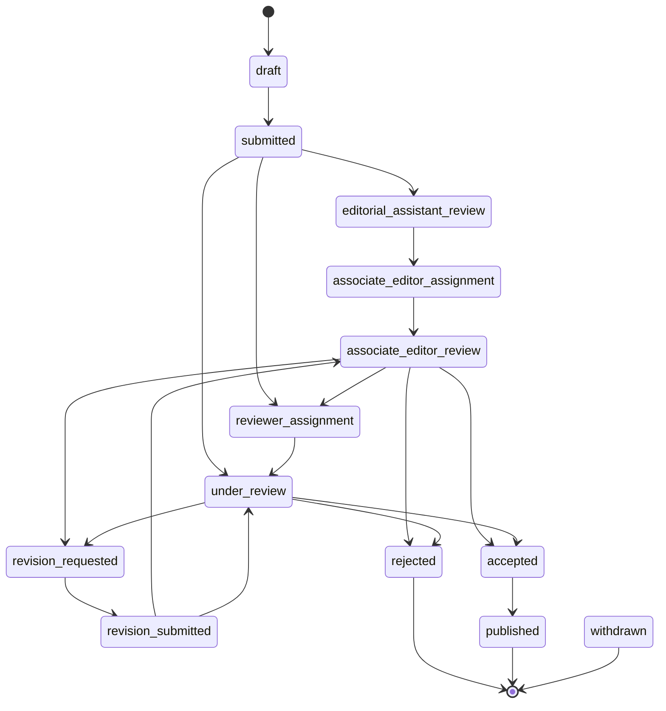

# Author Submission Workflow (Code-Derived)

This doc diagrams the exact flow and statuses derived from the codebase.

## Sequence: Author ➜ API ➜ Workflow

```mermaid
sequenceDiagram
  autonumber
  actor A as Author (UI)
  participant SUBMIT_UI as app/author/submit/page.tsx
  participant API as app/api/workflow/submit/route.ts
  participant WF as lib/workflow.ts (workflowManager)
  participant DB as Drizzle (articles, submissions, ...)
  participant EA as Editorial Assistant Service
  participant AE as Associate Editor
  participant REV as ReviewerAssignmentService

  A->>SUBMIT_UI: Fill 5-step form + upload files
  SUBMIT_UI->>API: POST /api/workflow/submit {articleData}
  API->>WF: workflowManager.submitArticle(articleData, authorId)
  note over WF: ArticleSubmissionService.submitArticle()
  WF->>DB: INSERT articles {status: submitted}
  WF->>DB: INSERT submissions {status: submitted, history}
  alt recommendedReviewers provided
    WF->>DB: INSERT recommended_reviewers (suggested)
  end
  WF->>WF: findSuitableEditor(category)
  alt editor found
    WF->>DB: UPDATE articles.status = editorial_assistant_review
    WF->>DB: updateSubmissionStatus(submissionId, editorial_assistant_review, system)
    WF-->>AE: Notification: New Editorial Assignment
  else no editor
    note over WF: stays submitted until picked up
  end
  WF-->>A: Notification: Submission Received

  %% Screening Phase
  EA->>EA: performInitialScreening(submissionId, EA_id, checks)
  EA->>DB: INSERT manuscript_screenings (passed/failed)
  alt all checks pass
    EA->>DB: updateSubmissionStatus(..., associate_editor_assignment)
    EA->>EA: autoAssignToAssociateEditor(submissionId)
    EA->>DB: UPDATE articles.editorId; status=associate_editor_review
    EA-->>AE: Notification: AE Assignment
  else any check fails
    EA->>DB: updateSubmissionStatus(..., revision_requested)
    EA-->>A: Notification + email: Revision Required
  end

  %% AE Review and Reviewer Assignment
  AE->>EA: assignAssociateEditor(submissionId, AE_id)
  EA->>DB: editorAssignments (pending)
  EA->>DB: updateSubmissionStatus(..., associate_editor_review)
  AE->>REV: assignReviewers(articleId, editorId)
  alt with recommendations
    REV->>DB: select recommended_reviewers
  end
  REV->>DB: create reviewInvitations / reviews, update reviewerProfiles
  REV->>DB: UPDATE articles/submissions.status = under_review
  REV-->>A: System notifications dispatched

  %% Review Completion
  participant RM as ReviewManagementService
  REV->>RM: submitReview(reviewId, data, reviewerId)
  RM->>DB: UPDATE reviews(status=completed,...)
  RM->>DB: decrement reviewerProfiles.currentReviewLoad
  RM->>DB: if all complete -> UPDATE articles.status = accepted|revision_requested|rejected
  RM-->>AE: Notification: Reviews Completed/Submitted
  RM-->>A: Notification: Reviews Completed
```

## States: Canonical Status Machine

Source: `lib/status.ts` and validations in `ArticleSubmissionService.updateSubmissionStatus()`.



## Components: Who Calls What

```mermaid
flowchart LR
  UI[app/author/submit/page.tsx] --> API[/api/workflow/submit/]
  API --> WF[workflowManager (lib/workflow.ts)]
  WF -->|submitArticle| DB[(articles, submissions, recommended_reviewers)]
  WF -->|findSuitableEditor| DB
  WF -->|updateSubmissionStatus| DB

  EA[EditorialAssistantService] -->|performInitialScreening| DB
  EA -->|assignAssociateEditor| DB
  EA -->|autoAssignToAssociateEditor| DB

  AE[Associate Editor] --> REV[ReviewerAssignmentService]
  REV -->|assignReviewers(WithRecommendations)| DB
  REV -->|performDirectAssignment| DB

  RM[ReviewManagementService] -->|submitReview| DB

  subgraph Notifications
    WF -.-> AE
    WF -.-> UI
    EA -.-> AE
    EA -.-> UI
    RM -.-> AE
    RM -.-> UI
  end
```

### Key Files/Functions
- UI: `app/author/submit/page.tsx` → POST to `/api/workflow/submit`
- API: `app/api/workflow/submit/route.ts` → `workflowManager.submitArticle`
- Services (in `lib/workflow.ts`):
  - `ArticleSubmissionService.submitArticle`
  - `ArticleSubmissionService.updateSubmissionStatus`
  - `EditorialAssistantService.performInitialScreening`
  - `EditorialAssistantService.assignAssociateEditor`
  - `EditorialAssistantService.autoAssignToAssociateEditor`
  - `ReviewerAssignmentService.assignReviewers(WithRecommendations)`
  - `ReviewManagementService.submitReview`
- Status model: `lib/status.ts` (`normalizeStatus`, `WORKFLOW_TRANSITIONS`, `canTransition`, `displayStatus`)

### Notes
- Both `articles.status` and `submissions.status` are updated to stay in sync.
- Status transitions are enforced via `validateWorkflowTransition()` using `WORKFLOW_TRANSITIONS`.
- Recommended reviewers are optional; if present, they’re stored in `recommendedReviewers` and factored into assignment.
- Notifications/emails are sent via `sendWorkflowNotification`/`sendEmail` and `notifications` table.
